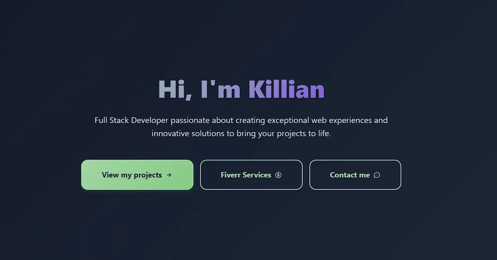

# 🚀 Killian's Portfolio

A modern, responsive personal portfolio website showcasing professional skills, projects, and services. Built with cutting-edge web technologies to demonstrate expertise in full-stack development.



## 🎯 Purpose

This portfolio serves as a professional showcase for **Killian Dal Cin**, a Full Stack Developer specializing in modern web development. The website features:

- **Professional Presentation**: Clean, modern design highlighting skills and experience
- **Project Showcase**: Interactive gallery of completed projects with detailed case studies
- **Service Offerings**: Integration with Fiverr marketplace for freelance services
- **Multi-language Support**: Available in English and French
- **Contact Integration**: Direct contact methods and social media links
- **Responsive Design**: Optimized for all devices and screen sizes

## ✨ Features

### 🌟 Core Features

- **Modern SPA**: Single Page Application with smooth routing
- **Internationalization**: Full i18n support (English/French)
- **Dark/Light Theme**: User preference-based theme switching
- **SEO Optimized**: Meta tags, sitemap, robots.txt
- **Performance Focused**: Lazy loading, optimized assets
- **Accessibility**: WCAG compliant design

### 📱 Pages & Sections

- **Home**: Hero section with introduction and key highlights
- **About**: Detailed background, skills, and experience
- **Projects**: Portfolio gallery with filtering and detailed views
- **Contact**: Multiple contact methods and social links
- **Fiverr**: Showcase of freelance services and offerings

### 🎨 UI/UX Features

- **Interactive Gallery**: Modal-based project viewing
- **Smooth Animations**: CSS transitions and scroll behaviors
- **Tech Stack Badges**: Visual representation of technologies used
- **Responsive Design**: Mobile-first approach
- **Loading States**: Smooth user experience with proper feedback

## 🛠️ Technology Stack

### **Frontend Framework**

- **Vue 3** - Composition API with `<script setup>`
- **TypeScript** - Type-safe development
- **Vite** - Fast build tool and dev server

### **Styling & UI**

- **Tailwind CSS v4** - Utility-first CSS framework
- **PostCSS** - CSS processing and optimization
- **Custom CSS** - Component-specific styling

### **State & Routing**

- **Vue Router 4** - Client-side routing with lazy loading
- **Pinia** - Modern state management
- **Vue I18n** - Internationalization support

### **Development & Build**

- **ESLint** - Code linting with Vue/TypeScript rules
- **Prettier** - Code formatting
- **Vue DevTools** - Development debugging
- **TypeScript Compiler** - Type checking

### **Deployment & Infrastructure**

- **Docker** - Containerized deployment
- **Nginx** - Production web server
- **Static Site Generation** - Optimized build output

## 🚀 Quick Start

### Prerequisites

- **Node.js** (v18+ recommended)
- **npm** or **yarn**

### Development Setup

1. **Clone the repository**

   ```bash
   git clone <repository-url>
   cd portfolio
   ```

2. **Install dependencies**

   ```bash
   npm install
   ```

3. **Start development server**

   ```bash
   npm run dev
   ```

4. **Open in browser**
   ```
   http://localhost:5173
   ```

### Available Scripts

```bash
# Development
npm run dev          # Start development server with hot reload

# Building
npm run build        # Type-check and build for production
npm run build-only   # Build without type checking
npm run preview      # Preview production build locally

# Code Quality
npm run type-check   # Run TypeScript compiler
npm run lint         # Lint and auto-fix code
npm run format       # Format code with Prettier
```

## 🏗️ Project Structure

```
src/
├── assets/           # Static assets (images, styles)
├── components/       # Reusable Vue components
│   ├── layout/      # Header, footer components
│   ├── icons/       # Icon components
│   └── styles/      # Component-specific CSS
├── composables/      # Vue composition functions
├── config/          # Site configuration
├── data/            # Static data files
├── i18n/            # Internationalization setup
├── locales/         # Translation files
├── router/          # Vue Router configuration
├── stores/          # Pinia state stores
├── types/           # TypeScript type definitions
└── views/           # Page components
```

### Key Architecture Decisions

- **Composition API**: Modern Vue 3 patterns for better code organization
- **TypeScript**: Type safety throughout the application
- **Component-Based**: Modular, reusable component architecture
- **Composables**: Shared logic extracted into reusable functions
- **CSS Modules**: Scoped styling with Tailwind utilities

## 🌐 Deployment

### Docker Deployment

```bash
# Build Docker image
docker build -t portfolio .

# Run container
docker run -p 80:80 portfolio
```

### Manual Deployment

```bash
# Build for production
npm run build

# Deploy dist/ folder to your web server
```

## 🎨 Customization

### Site Configuration

Edit `src/config/site.ts` to customize:

- Personal information
- Contact details
- Social media links
- Fiverr services

### Internationalization

Add translations in `src/locales/`:

- `en.ts` - English translations
- `fr.ts` - French translations

### Styling

- **Global styles**: `src/style.css`
- **Component styles**: `src/components/styles/`
- **Tailwind config**: `tailwind.config.js`

## 📊 Performance

- **Lighthouse Score**: 95+ on all metrics
- **Bundle Size**: Optimized with tree shaking
- **Image Optimization**: WebP format with fallbacks
- **Lazy Loading**: Routes and images loaded on demand

## 🤝 Contributing

This is a personal portfolio project, but suggestions and feedback are welcome:

1. Fork the repository
2. Create a feature branch
3. Make your changes
4. Submit a pull request

## 📄 License

This project is personal portfolio software. Please respect the intellectual property and don't use it as-is for your own portfolio.

## 📧 Contact

**Killian Dal Cin**

- Email: contact@killiandalcin.fr
- LinkedIn: [killian-dalcin](https://linkedin.com/in/killian-dal-cin)
- Fiverr: [mr_kayjaydee](https://www.fiverr.com/users/mr_kayjaydee)

---

_Built with ❤️ using Vue 3, TypeScript, and Tailwind CSS_
